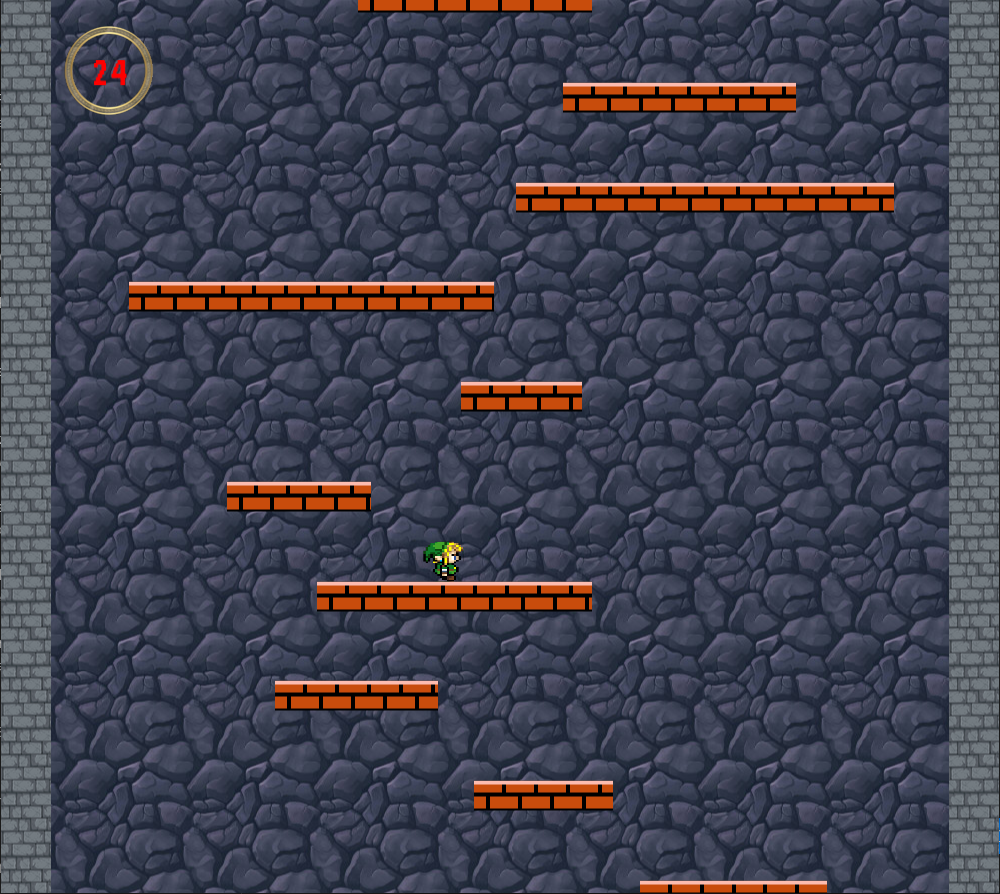
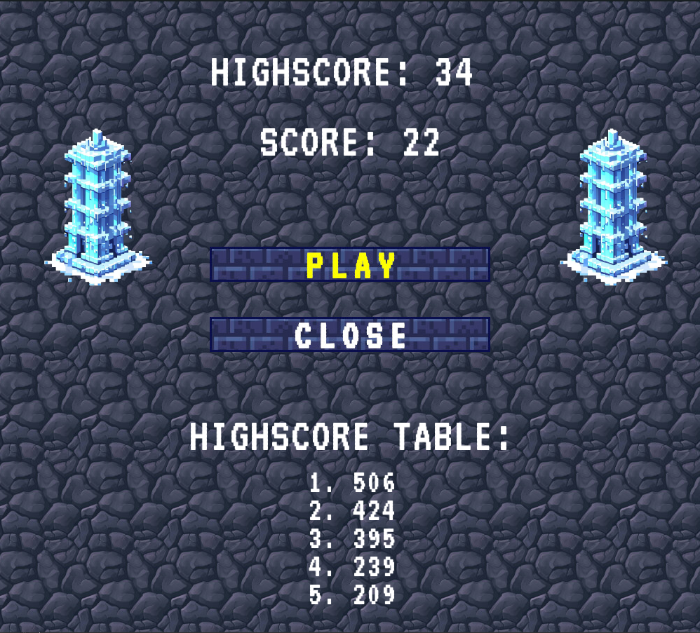

# PROI_PROJEKT

Authors:
- Paweł Skorupski
- Jakub Kryczka

## Interesting features
- smart collision implementation
- TextureManager Class to improve texture handling
- scoreboard and highscore keeping
- creating a limited amount of platforms and destroying unused ones
- wallJumping implementation

## Project: Icy Tower Clone

The aim of the project was to create a game similar to the popular ["Icy Tower"](https://en.wikipedia.org/wiki/Icy_Tower), a well known platform game.

The game's purpose is for the player to reach the highest level he can manage while jumping from platform to platform and bouncing off walls.

## Implemented classes

- GameRunner
- Game 
- Player
- MainMenu
- EndGame
- Tile
- UIButton

## Controls
- `space` -> Jump
- `←` -> Move left
- `→` -> Move right

# How does it work?

## Step I - The Main Menu

The Player is greeted with the game's logo and two options
- Start the game
- Close the game

Upon choosing the first one, the game proceeds, the second option closes the window.

## Step II - The Game Itself
When the game has started, the player will find himself on the first level of the titular "Icy Tower". 

The aim of the game is to jump as high as possible without falling down.

There is a catch tough.

If the player gets through the first few levels the tower will "start collapsing", meaning the game arena will be constantly moving up, forcing the player to soar through levels faster and faster.

## Step III - The EndGame Screen
Upon the player's fall to his inevitable demise, an EndGame screen is displayed, featuring his current score, the best score he got in the current playing session and five of the top scores of all time.

From here, the player can choose either to try the game again, or leave it and close the program.

| Main Game | Exit Menu |
|:---------:|:---------:|
|  |  |